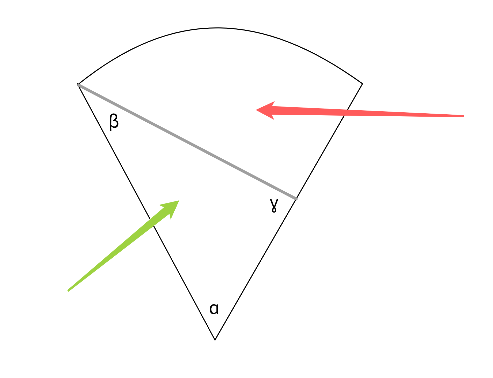

# Lazy Cake Slice

Basically, the question is, "How do I cut a slice of cake into two equal parts
in the unorthodox way of starting at one of the intersections of the slice's
arc and straight edge and cutting through in a straight line to the opposite
straight edge?"

This is convoluted to understand in words, so the graphic below should help
illuminate what I'm trying to determine.

The grey line is an example of one such cut. The objective is to choose a cut
(parameterized by angles β) such that the area of the two pieces (denoted
by the green and red arrows) are equal.

See the `cake_slice_calculator.py` docstring for more context.

## Motivation

I thought of this problem in April 2021 when splitting a slice of
cake with my mom. 👩‍👦 This is useful to know if you're splitting a
particularly thin slice of cake because this sort of cut is easier to make!

I also wanted to practice writing tests for `pytest` and implementing OOP
principles in Python.
